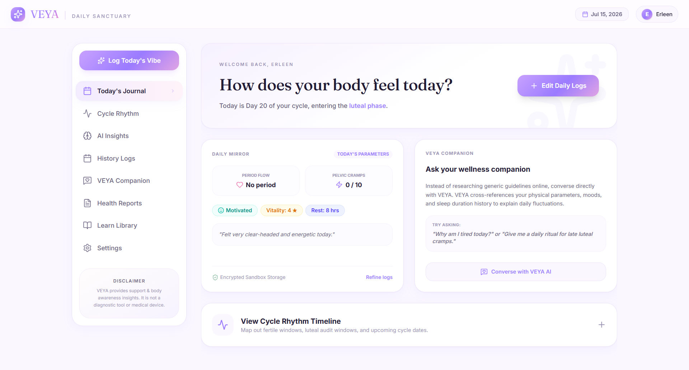
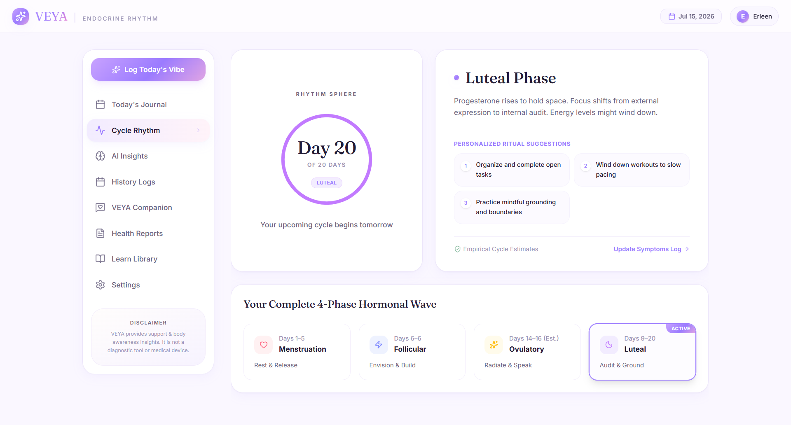
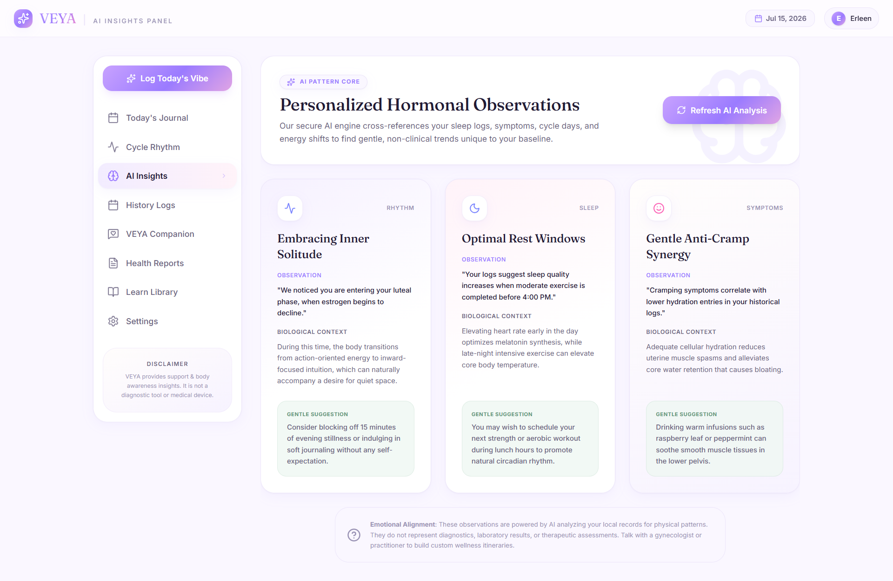
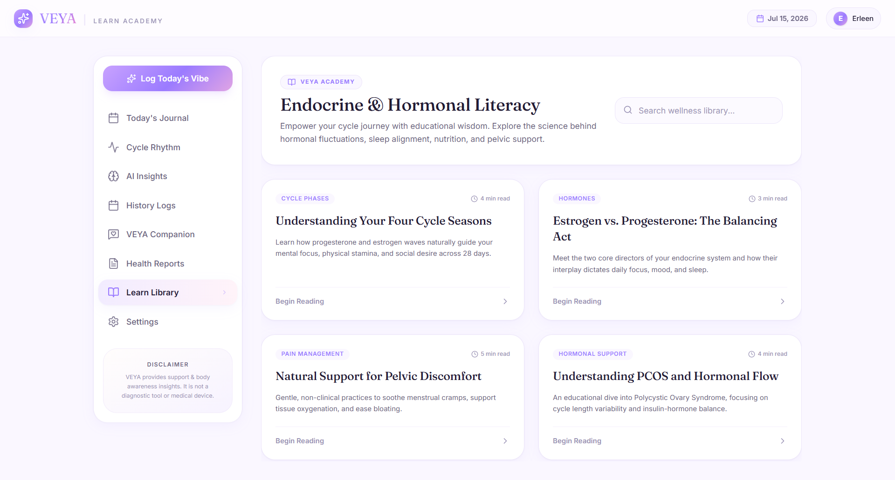

# VEYA — A deeper understanding of you 🌙

AI-powered menstrual wellness companion designed to help women understand their cycle, track patterns, and gain personalized insights.

**Track • Understand • Reflect**

---

## 🔗 Live Demo

[Live Link](link)

---

## 💡 Overview

VEYA is an AI-powered menstrual wellness application focused on helping users build a deeper understanding of their body through cycle tracking, journaling, and personalized insights.

The platform helps users:

- Track menstrual cycle patterns
- Maintain a personal cycle journal
- Visualize health-related patterns over time
- Receive AI-powered reflections and insights
- Build awareness around their individual cycle experience

VEYA combines technology and wellness to create a more personalized and empowering user experience.

---

## 🧠 AI Integration

VEYA uses AI to provide:

- Personalized cycle-based insights
- Pattern recognition from user journal entries
- Conversational wellness assistance
- Meaningful reflections based on tracked data

The AI layer is designed to support self-awareness and informed decision-making, not replace professional medical advice.

---

# 🛠️ Tech Stack

## Frontend

- React
- TypeScript
- Tailwind CSS
- Vite

## Backend & Services

- Firebase Authentication
- Firebase Firestore
- Firebase Storage

## AI Integration

- Gemini AI-powered insights engine

---

# ✨ Key Features

🌸 **Cycle Journal**

- Record cycle experiences
- Track symptoms, moods, and personal observations
- Maintain a long-term wellness timeline

🧠 **AI Insights**

- Analyze user patterns
- Generate personalized reflections
- Provide meaningful wellness suggestions

📊 **Pattern View**

- Visualize cycle trends
- Understand recurring patterns
- Encourage self-awareness

🌙 **Personalized Experience**

- User-focused wellness dashboard
- Clean and calming interface
- Responsive design

---

# 📸 Screenshots

## Dashboard - Today's Journal



## Cycle Rhythm 



## AI Insights



## Educational Insights



---

# ⚙️ System Architecture

User Flow:

1. User creates an account
2. User tracks cycle information and journal entries
3. Data is securely stored
4. AI processes available patterns
5. Personalized insights are generated
6. User views reflections through the wellness dashboard

---

# 📂 Project Structure

```

VEYA/
│
├── src/                  # React frontend
├── components/           # Reusable UI components
├── pages/                # Application pages
├── services/             # Firebase and AI services
├── assets/               # Images and static files
├── package.json          # Dependencies
├── vite.config.ts        # Vite configuration
├── tsconfig.json         # TypeScript configuration
└── README.md

````

---

# 🚀 Future Improvements

- Advanced AI wellness assistant
- More detailed cycle analytics
- Reminder and notification system
- Health risk detection
- Mobile application support
- Additional personalization features

---

# 🏁 Setup Instructions

Clone the repository:

```bash
git clone https://github.com/<your-username>/VEYA.git
````

Navigate to the project:

```bash
cd VEYA
```

Install dependencies:

```bash
npm install
```

Run development server:

```bash
npm run dev
```

---

# 🎯 Project Goals

VEYA aims to:

* Encourage better understanding of menstrual health patterns
* Make cycle tracking more personalized
* Use AI to enhance wellness awareness
* Create a supportive digital wellness experience

---

# 📌 Author

With ❤️ by [@erleen0307](https://github.com/erleen0307/)
<br>
📅 Date Completed: July 12, 2026

```
That combination is actually quite compelling for an internship profile.
```
